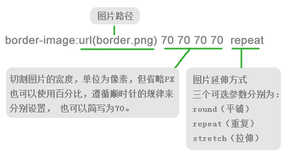

# css3基础
## 初识
1. CSS3基于CSS2增加了很多新的功能
虽然很多新版本的浏览器已经能够实现CSS3的新功能，但为了更好的向前兼容低版本浏览器，还是需要加上一些兼容性前缀。
浏览器|兼容性前缀
chrome和safari|-webkit
firefox|-moz
IE|-ms
opera|-o
2. CSS3简化了前端开发人员的设计过程，加快了页面的载入速度。提供了强大的功能，如：强大的选择器、圆角效果、块阴影与文字阴影、更多的色彩、渐变效果、个性化字体、多背景图、边框背景图、变形处理、多栏布局、媒体查询等等，CSS3使代码更简洁，更高效，可以极大的提高工作效率，打造更高级的用户体验。
## 边框
1. border-radius 向元素添加圆角边框
使用方法：
`
border-radius:10px;/*所用的角都使用半径为10px的圆角*/
`
还可以分开规定四个角的半径：
`
border-radius:5px 4px 2px 6px;/*四个半径值分别为左上角、右上角、右下角、左下角，顺时针方向*/
`
还可以用em 和 百分比，但是兼容性不是很好。
2. box-shadow 向盒子添加阴影
支持一个或多个，多个的话每个之间用逗号隔开。
语法：
`
box-shadow:[x轴偏移量] [y轴偏移量] [阴影模糊半径] [阴影扩展半径] [阴影颜色] [投影方式（有inset是内阴影，省略为默认外阴影）];
`
`
box-shadow:3px 4px 2px 4px #f55566, -4px -3px 2px 5px #a34577 inset;
`
### 阴影模糊半径与阴影扩展半径的区别

阴影模糊半径：此参数可选，其值只能是为正值，如果其值为0时，表示阴影不具有模糊效果，其值越大阴影的边缘就越模糊；

阴影扩展半径：此参数可选，其值可以是正负值，如果值为正，则整个阴影都延展扩大，反之值为负值时，则缩小；

### X轴偏移量和Y轴偏移量值可以设置为负数
3. border-image 为边框应用背景图片
语法：
`
border-image:url(http://img.mukewang.com/52e22a1c0001406e03040221.jpg) 15px repeat;/* 路径 切割图片的宽度 重复或平铺或拉伸 */
`

## 颜色相关
1. RGB是一种色彩标准，是由红(R)、绿(G)、蓝(B)的变化以及相互叠加来得到各式各样的颜色。RGBA是在RGB的基础上增加了控制alpha透明度的参数。

语法：

`
color:rgba(R,G,B,A)
`

R G B三个参数，正整数值的取值范围：0 ———— 255 ，百分数值的取值范围：0.0% ———— 100.0% ，但并非所有的浏览器都支持百分数的值。

2. 渐变颜色

CSS3 Gradient分为线性渐变（linear）和径向渐变（radial）。

线性渐变：

`
linear-gradient（to bottom, #fff,#999);
`

参数：

第一个参数：指定渐变方向，可以用“角度”的关键词或“英文”来表示：

第一个参数省略时，默认为180deg，等同于“to bottom”.
第二个参数和第三个参数，表示颜色的起始点和结束点，可以有多个颜色值。
